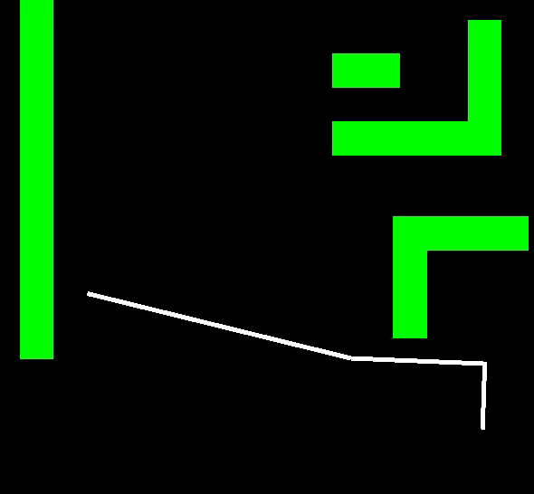
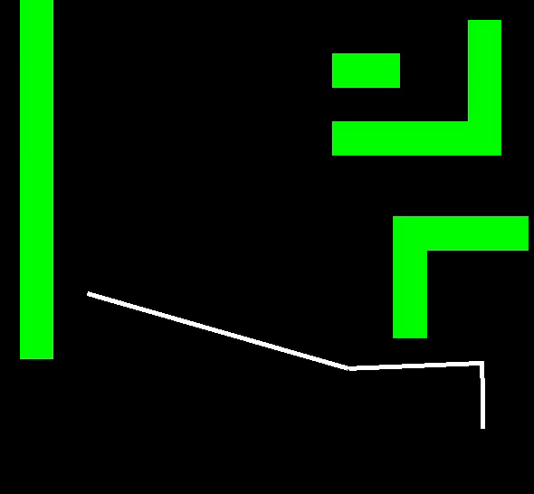

# planar_arm

C++ library for 3-link planar arm. Implements kinematics, inverse kinematics, collision detection, and path planning (bidirectional RRT with shortcutting).

## Build and run on Linux

Install SFML
```
sudo apt-get install libsfml-dev
```
Clone repository
```
git clone https://github.com/rsandzimier/planar_arm.git
cd planar_arm
```

Build with cmake (3.16.3 or later. Note: Earlier versions may work, but have not been tested. Change version in CMakeLists.txt)
```
cmake -B build
cmake --build build
```
Run demo
```
./build/demo
```
## Demo

### Demo options

There are 3 demos provided: RRT demo, sinusoid demo, and circle demo. By default, `./build/demo` only runs the RRT demo. 
Optionally use command line arguments `-rrt`, `--sinusoid`, and `--circle` to run the respective demo. For example, `./build/demo --sinusoid` 
to run the sinusoid demo.

### RRT Demo

Creates an environment with a 3-link planar arm and obstacles and plans a collision-free path between two arm configurations using 
bidirectional RRT (with shortcutting). The planned path is then displayed in an animation. Use option `--rrt` when running `./build/demo`.

### Sinusoid Demo

Moves each joint of a planar arm as a sinusoid and displays an animation of the trajectory. Use option `--sinusoid` when running `./build/demo`.

### Circle Demo

Moves the end effector on a circular trajectory and displays an animation of the trajectory. Uses inverse kinematics to calculate joint 
positions at each time step. Use option `--sinusoid` when running `./build/demo`.

### Examples from RRT demo



